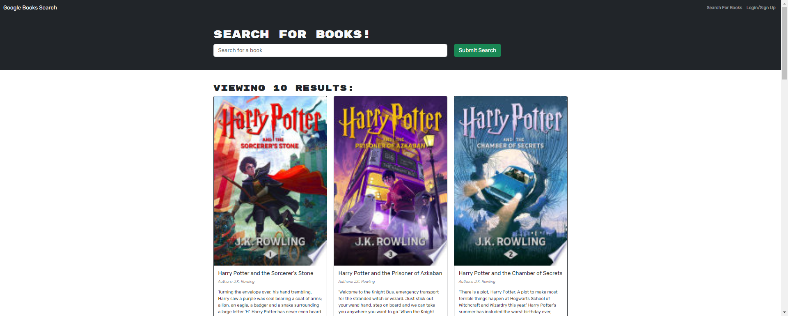

# 21 Book Search Engine

## Description

This application was a fully functioning Google Books API search engine built with a RESTful API that needed to be refactored to be a GraphQL API built with Apollo Server. The app was built using the MERN stack with a React front end, MongoDB database, and Node.js/Express.js server and API.

## Table of Contents

- [Introduction](#introduction)
- [Problem](#problem)
- [Solution](#solution)
- [Contributors](#contributors)
- [Contact](#contact)
- [License](#license)

## Introduction

The client, an avid reader, would like to search for new books to read so that they can keep a list of books to purchase.

## Problem

As a user of the book search engine, when the search engine is loaded, the user is presented with a menu that includes options such as "Search for Books" and "Login/Signup", along with an input field to search for books and a submit button.

When the user clicks on the "Search for Books" menu option, they are directed to a page featuring an input field to search for books and a submit button.

If the user is not logged in and enters a search term in the input field and clicks the submit button, several search results are displayed. Each result includes a book’s title, author, description, image, and a link to that book on the Google Books site.

Clicking on the "Login/Signup" menu option triggers a modal to appear on the screen, offering a toggle between logging in or signing up.

If the user chooses to sign up, they are presented with three input fields: one for a username, one for an email address, and one for a password, along with a signup button. If they opt to log in instead, they see two input fields: one for an email address and one for a password, as well as a login button.

Upon entering a valid email address, creating a password, and clicking the signup button, the user’s account is created and they are logged in to the site.

When the user enters their account’s email address and password and clicks the login button, the modal closes and they are logged in to the site.

Once logged in, the menu options change to "Search for Books", an option to see saved books, and "Logout".

If the user is logged in and enters a search term in the input field and clicks the submit button, several search results are displayed. Each result features a book’s title, author, description, image, and a link to that book on the Google Books site, as well as a button to save the book to their account.

Clicking the "Save" button on a book saves that book’s information to the user’s account.

Clicking on the option to see saved books presents the user with all the books they have saved to their account. Each saved book includes the book’s title, author, description, image, and a link to that book on the Google Books site, along with a button to remove the book from their account.

Clicking the "Remove" button on a book deletes that book from the user’s saved books list.

Clicking the "Logout" button logs the user out of the site and presents them with a menu that includes options such as "Search for Books" and "Login/Signup", along with an input field to search for books and a submit button.

## Solution

Here is link to the deployed application on Render:
[Link to deployed app](https://book-search-engine-mw3x.onrender.com)

and here is a screenshot:

## Contributors

I used chatgpt and Github copilot to troubleshoot bugs.

## Contact

You can contact me here is you have questions:

Github: [ktetsuyama](https://github.com/ktetsuyama)

Email: [kroyal.eisenberg@gmail.com](mailto:kroyal.eisenberg@gmail.com)

## License

## License

This project is covered under the 

Learn more about this license [here](https://opensource.org/licenses/MIT).

Thank you for reading.
